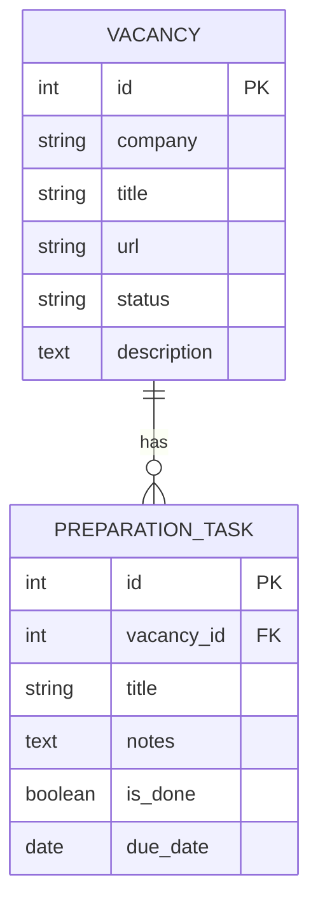

# ApplyFlow

ApplyFlow is a backend API for tracking internship applications and preparation tasks.

The project started as an in-memory FastAPI application and now uses PostgreSQL as the persistence layer with asynchronous SQLAlchemy 2.0, Alembic migrations, Docker Compose, and async integration tests.

## Features

- Full CRUD for internship vacancies
- Vacancy filtering by status and company
- Limit/offset pagination for vacancy lists
- Full CRUD for preparation tasks attached to a vacancy
- Task filtering by `task_id`, `is_done`, and `due_date`
- Vacancy statistics calculated in PostgreSQL with `COUNT` / `GROUP BY`
- PostgreSQL foreign key between vacancies and preparation tasks
- Database-level cascade deletion of tasks when a vacancy is deleted
- Pydantic request validation and typed response schemas
- Async database access with one `AsyncSession` per request
- Alembic schema migrations
- Separate PostgreSQL test database for integration tests
- Automatic OpenAPI / Swagger documentation

## Tech Stack

- Python 3.14
- FastAPI
- Pydantic 2
- SQLAlchemy 2.0 ORM
- SQLAlchemy asyncio (`AsyncEngine`, `AsyncSession`, `async_sessionmaker`)
- Psycopg 3 async driver
- PostgreSQL 17
- Alembic
- pytest + AnyIO
- HTTPX `AsyncClient` + `ASGITransport`
- Uvicorn
- Docker
- Docker Compose

## Architecture

A request that needs the database follows this path:

```text
HTTP request
    ↓
FastAPI route
    ↓
Pydantic schema
    ↓
service layer
    ↓
AsyncSession
    ↓
SQLAlchemy ORM
    ↓
Psycopg async driver
    ↓
PostgreSQL
```

Each HTTP request receives its own `AsyncSession` through a FastAPI dependency.

## Data Model



`preparation_tasks.vacancy_id` references `vacancies.id` with `ON DELETE CASCADE`, so deleting a vacancy also deletes its preparation tasks at the database level.

## Project Structure

```text
.
├── alembic/
│   ├── env.py
│   └── versions/
├── app/
│   ├── db/
│   │   ├── base.py
│   │   └── session.py
│   ├── models/
│   │   ├── vacancy.py
│   │   └── task.py
│   ├── routes/
│   │   ├── health.py
│   │   ├── vacancies.py
│   │   ├── tasks.py
│   │   └── stats.py
│   ├── schemas/
│   │   ├── vacancies.py
│   │   └── tasks.py
│   ├── services/
│   │   ├── vacancy_service.py
│   │   ├── task_service.py
│   │   └── stats_service.py
│   ├── config.py
│   ├── dependencies.py
│   └── main.py
├── tests/
│   ├── conftest.py
│   ├── test_health.py
│   ├── test_vacancies.py
│   └── test_tasks.py
├── alembic.ini
├── compose.yaml
├── Dockerfile
├── pytest.ini
├── requirements.txt
├── .env.example
└── README.md
```

## Running the Project

The project is intended to run through Docker Compose. Inside the Compose network, the API connects to PostgreSQL using the service hostname `db`.

### Prerequisites

Install:

- Docker Desktop / Docker Engine
- Docker Compose
- Git

### 1. Clone the repository

```bash
git clone https://github.com/ogdoggen/applyflow.git
cd applyflow
```

### 2. Create `.env`

Copy the example:

```bash
cp .env.example .env
```

Example development values:

```env
APP_NAME=ApplyFlow API
APP_ENV=Development
DEBUG=False

POSTGRES_DB=applyflow
POSTGRES_USER=applyflow_user
POSTGRES_PASSWORD=change_me

DATABASE_URL=postgresql+psycopg_async://applyflow_user:change_me@db:5432/applyflow
TEST_DATABASE_URL=postgresql+psycopg_async://applyflow_user:change_me@db:5432/applyflow_test
```

The password in `DATABASE_URL` and `TEST_DATABASE_URL` must match `POSTGRES_PASSWORD`.

### 3. Build and start the services

```bash
docker compose up -d --build
```

Check container status:

```bash
docker compose ps
```

### 4. Apply database migrations

```bash
docker compose exec api alembic upgrade head
```

Check the current migration:

```bash
docker compose exec api alembic current
```

Migration history:

```bash
docker compose exec api alembic history
```

### 5. Open the API

- Swagger UI: http://localhost:8000/docs
- ReDoc: http://localhost:8000/redoc
- Health check: http://localhost:8000/health

## Clean Installation Check

To verify that the project can be reproduced from an empty PostgreSQL volume:

```bash
docker compose down -v
docker compose up -d --build
docker compose exec api alembic upgrade head
docker compose exec api alembic current
```

No tables need to be created manually with SQL.

## Running Tests

Integration tests use a separate PostgreSQL database named `applyflow_test`.

After a clean PostgreSQL volume, create it once:

```bash
docker compose exec db \
  psql -U applyflow_user -d postgres \
  -c "CREATE DATABASE applyflow_test;"
```

Then run the test suite inside the API container:

```bash
docker compose exec api python -m pytest -q
```

The test setup creates and drops application tables only inside `applyflow_test`; the development `applyflow` database is separate.

## Available Endpoints

| Method | Endpoint | Description |
|---|---|---|
| GET | `/` | Root endpoint |
| GET | `/health` | Health check |
| GET | `/vacancies` | List vacancies with filters/pagination |
| POST | `/vacancies` | Create a vacancy |
| GET | `/vacancies/{vacancy_id}` | Get one vacancy |
| PATCH | `/vacancies/{vacancy_id}` | Partially update a vacancy |
| DELETE | `/vacancies/{vacancy_id}` | Delete a vacancy |
| GET | `/vacancies/{vacancy_id}/tasks` | List tasks for a vacancy |
| POST | `/vacancies/{vacancy_id}/tasks` | Create a task for a vacancy |
| GET | `/vacancies/{vacancy_id}/tasks/{task_id}` | Get one preparation task |
| PATCH | `/vacancies/{vacancy_id}/tasks/{task_id}` | Partially update a task |
| DELETE | `/vacancies/{vacancy_id}/tasks/{task_id}` | Delete a task |
| GET | `/stats` | Vacancy statistics grouped by status |

### Vacancy query parameters

`GET /vacancies` supports:

- `status`
- `company`
- `limit`
- `offset`

Example:

```text
GET /vacancies?status=applied&company=Yandex&limit=10&offset=0
```

### Task query parameters

`GET /vacancies/{vacancy_id}/tasks` supports:

- `task_id`
- `is_done`
- `due_date`

Example:

```text
GET /vacancies/1/tasks?is_done=false&due_date=2026-08-15
```

## Example: Create a Vacancy

```http
POST /vacancies
Content-Type: application/json
```

```json
{
  "company": "Yandex",
  "title": "Python Backend Intern",
  "url": "https://example.com/jobs/backend-intern",
  "status": "applied",
  "description": "Backend internship application"
}
```

Available vacancy statuses:

- `saved`
- `applied`
- `test`
- `interview`
- `offer`
- `rejected`

## Example: Update a Vacancy

`PATCH` only changes fields that are present in the request body.

```http
PATCH /vacancies/1
Content-Type: application/json
```

```json
{
  "status": "interview",
  "description": "Technical interview scheduled"
}
```

## Example: Create a Preparation Task

```http
POST /vacancies/1/tasks
Content-Type: application/json
```

```json
{
  "title": "Prepare SQL questions",
  "notes": "Review joins, indexes and transactions",
  "due_date": "2026-08-15"
}
```

## Demo Scenario

A short scenario for demonstrating the project:

1. Create two vacancies with `POST /vacancies`.
2. Filter vacancies with `GET /vacancies?status=saved`.
3. Update one vacancy with `PATCH /vacancies/{id}`.
4. Create several preparation tasks for that vacancy.
5. Update a task, for example set `is_done=true`.
6. Open `/stats` and show database-calculated vacancy statistics.
7. Delete the vacancy.
8. Verify that its preparation tasks were removed by PostgreSQL cascade deletion.

## Useful Commands

View API logs:

```bash
docker compose logs api --tail=100
```

Open PostgreSQL shell:

```bash
docker compose exec db \
  psql -U applyflow_user -d applyflow
```

Stop containers without deleting data:

```bash
docker compose down
```

Delete containers and PostgreSQL volume:

```bash
docker compose down -v
```

> `docker compose down -v` permanently deletes the local PostgreSQL volume and all development data stored in it.
